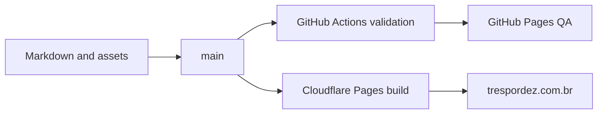

# Architecture

## Stack

- Jekyll builds Markdown, Liquid templates, data files, CSS, and static assets into `_site`.
- GitHub stores source, history, Discussions, Actions, and QA build artifacts.
- GitHub Pages exposes QA at `marcelofrau.github.io/trespordez`.
- Cloudflare Pages serves production at `trespordez.com.br` after DNS cutover.
- Giscus embeds GitHub Discussions comments. No database or application server exists.

## Deployment

Cloudflare configuration stays outside source because it contains account-level state. See `platform-setup.md`.
