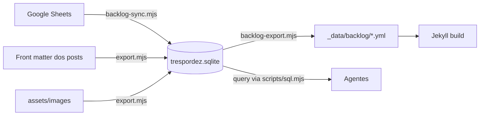

# Três por Dez — Arquitetura de Banco de Dados (SQLite)

> Status: FASE 0 concluída — inventário e schema proposto.
> Objetivo: `data/trespordez.sqlite` como camada única de dados consultável pelos agentes, mantendo o site Jekyll intacto.

---

## Por que SQLite

- Edição fácil (DBeaver, CLI `sqlite3`, script de sync).
- Commit do banco no git — histórico de mudanças, diff legível.
- **Agentes consultam via SQL** em vez de caçar YAML/front matter espalhado por 300+ arquivos.
- Zero infra: funciona no build do Cloudflare (Node ≥ 24 tem `node:sqlite` nativo, sem dependência).

## Modelo conceitual

Há dois grupos de dados, com papéis diferentes. **Não tratar os dois da mesma forma** é a decisão central.



### Grupo 1 — Tabelas "fonte da verdade" (edita no banco, build consome)

| Tabela | Origem hoje | Papel |
|---|---|---|
| `players` | `_data/authors.yml` | jogadores do backlog |
| `backlog_items` | `_data/backlog/*.yml` ← Sheets | a lista de jogos |
| `categories` | `_data/categories.yml` | taxonomia editorial |
| `platforms` | `_data/platforms.yml` | catálogo de plataformas (chave FK) |

### Grupo 2 — Tabelas "projeção" (geradas no build a partir do markdown; sqlite = camada de consulta)

| Tabela | O que resolve |
|---|---|
| `content` | 1 linha por post/página: slug, title, date, author, url, image... Agente responde "posts de Saturn e PS1" via SQL |
| `content_categories` / `content_tags` | relações M2M derivadas do front matter |
| `scores` | notas extraídas dos blocos `.review-score` dos posts |
| `media` | inventário de `assets/images/` + quem usa cada asset |
| `links` | URLs externas citadas nos posts (preservação) |

O markdown **continua dono** de posts/conteúdo — reescrever HTML de post a partir de DB seria regressão no que funciona. Projeção = derive, não edite.

---

## Inventário completo (fase 0)

Tudo que existe hoje no repo que passa a ter representação SQL:

| Fonte | Arquivos | Campos |
|---|---|---|
| Posts | `_posts/*.md` (21) | `title, date, author, categories, tags, description, excerpt, image, image_alt, image_fit, image_position, wordpress_id, wordpress_url, wordpress_featured_image` |
| Scores | bloco `<section class="review-score">` nos posts | 5 slots: Graphics/Sound/Gameplay/Challenge/Overall (labels usam pt **e** en, valores às vezes `9/10`, às vezes `8.5`, às vezes sem `/10`) |
| Backlog | `_data/backlog/{player}.yml` (2) | seções `backlog, played, dropped, catalog`; itens com `name, platform, status, mood, humor, reason`, scores `graf, som, gameplay, desafio, geral` |
| Pages | `_pages/*.md` (150+) | `title, permalink, layout`; `category_key`/`tag_key` em páginas de taxonomy; `emulator/summary/emulators` em plataformas; `video_id/source_url` em ports |
| Autores | `_data/authors.yml` | `name, slug, url, avatar` |
| Categorias | `_data/categories.yml` (11) | `name, url, color` |
| Plataformas | `_data/platforms.yml` (45) + `_pages/platforms/*` (44) | `name, image, url, available`; páginas com `summary, emulators` |
| Ports | `_pages/ports/*` (12) | `platform, summary, video_id, source_url` |
| Tags | `_pages/tag/*` (98) | derivadas dos posts |
| Media | `assets/images/` (posts 22 dirs, páginas, ui, authors, site) | ~450 arquivos |
| Navegação | `_data/navigation.yml` | estrutura do menu |
| Quotes | `_data/quotes.yml` (300+) | citações rotativas |
| Socials | `_data/socials.yml` | links externos |
| Analytics | `_data/analytics.yml` | token beacon (público) |

### Achados que moldam o schema

1. **Scores fragmentados**: labels em pt (`Gráficos, Som, Gameplay, Desafio, Geral`) **ou** en (`Graphics, Sound, ...`); valores `10/10`, `10`, `8.5/10` — o parser precisa tolerar tudo. Guardar `REAL` + `raw` JSON.
2. **Duas fontes de nota**: o bloco do post e a coluna `played` do backlog **nem sempre batem** (ex.: Art of Rally 10 do sheet vs 9 do card). Excelente caso de uso de view de consistência.
3. **`status`/`mood` são emojis** — textos livres, não enum.
4. **Platform do backlog** é texto livre (`PC`, `PS1`...) — FK por *match* aproximado via view, nunca por constraint rígida.
5. **`wordpress_*`**: só registros antigos de migração; não renderizam. Manter como histórico.
6. **`image_position` default** é `center 24%` — importante guardar para regenerar cards.

---

## Schema proposto

```sql
CREATE TABLE meta (
  key TEXT PRIMARY KEY,            -- schema_version, last_export_at, last_sync_at
  value TEXT
);

CREATE TABLE players (
  key   TEXT PRIMARY KEY,          -- the-archivist, cezar-aug
  name  TEXT NOT NULL,
  slug  TEXT NOT NULL,
  url   TEXT,
  avatar TEXT
);

CREATE TABLE categories (
  key   TEXT PRIMARY KEY,          -- reviews, moddding...
  name  TEXT NOT NULL,
  url   TEXT,
  color TEXT
);

CREATE TABLE platforms (
  key   TEXT PRIMARY KEY,          -- slug: playstation, sega-cd...
  name  TEXT NOT NULL,
  url   TEXT,
  image TEXT,
  available INTEGER,
  summary TEXT,
  emulator TEXT,
  emulators TEXT
);

-- CORE: todo item de backlog de qualquer jogador
CREATE TABLE backlog_items (
  id        INTEGER PRIMARY KEY AUTOINCREMENT,
  player_key TEXT NOT NULL REFERENCES players(key),
  section   TEXT NOT NULL CHECK (section IN ('backlog','played','dropped','catalog')),
  pos       INTEGER NOT NULL,      -- ordem dentro da seção
  name      TEXT NOT NULL,
  platform  TEXT,                  -- texto livre do sheet
  status    TEXT,                  -- emoji
  mood      TEXT,                  -- emoji
  humor     TEXT,                  -- emoji
  reason    TEXT,
  graf      REAL, som REAL, gameplay REAL, desafio REAL, geral REAL,
  post_slug TEXT,                  -- link p/ content quando houver
  UNIQUE (player_key, section, pos)
);

-- PROJEÇÃO: conteúdo gerado no build
CREATE TABLE content (
  slug TEXT PRIMARY KEY,           -- nome do arquivo sem data/ext
  kind TEXT NOT NULL,              -- post | page | platform | port | category | tag
  title TEXT NOT NULL,
  date TEXT,                      -- ISO
  author_key TEXT REFERENCES players(key),
  path TEXT,                      -- _posts/x.md
  url TEXT,
  description TEXT,
  excerpt TEXT,
  image TEXT, image_alt TEXT, image_fit TEXT, image_position TEXT,
  wordpress_id INTEGER, wordpress_url TEXT, wordpress_featured_image TEXT,
  layout TEXT
);

CREATE TABLE content_categories (
  content_slug TEXT NOT NULL REFERENCES content(slug),
  category_key TEXT NOT NULL REFERENCES categories(key)
);

CREATE TABLE content_tags (
  content_slug TEXT NOT NULL REFERENCES content(slug),
  tag TEXT NOT NULL
);

CREATE TABLE scores (
  id INTEGER PRIMARY KEY AUTOINCREMENT,
  content_slug TEXT NOT NULL REFERENCES content(slug),
  graf REAL, som REAL, gameplay REAL, desafio REAL, geral REAL,
  raw TEXT                          -- HTML do bloco, p/ auditoria
);

CREATE TABLE media (
  path        TEXT PRIMARY KEY,    -- assets/images/...
  kind        TEXT NOT NULL,       -- post | page | author | ui | site
  content_slug TEXT REFERENCES content(slug),
  size        INTEGER,
  updated_at  TEXT
);

CREATE TABLE links (
  id INTEGER PRIMARY KEY AUTOINCREMENT,
  content_slug TEXT NOT NULL REFERENCES content(slug),
  url TEXT NOT NULL,
  label TEXT
);

CREATE TABLE meta_log (
  id INTEGER PRIMARY KEY AUTOINCREMENT,
  ran_at TEXT NOT NULL,
  script TEXT NOT NULL,
  detail TEXT
);
```

### Views úteis para agentes

```sql
-- Notas do sheet vs nota do card do post
CREATE VIEW v_score_consistency AS
SELECT b.post_slug, b.name, b.graf AS sheet_graf, s.graf AS card_graf,
       b.geral AS sheet_geral, s.geral AS card_geral
FROM backlog_items b
JOIN scores s ON s.content_slug = b.post_slug
WHERE b.section='played' AND b.geral IS NOT NULL;

-- Posts por plataforma (match aproximado de texto)
CREATE VIEW v_posts_by_platform AS
SELECT c.slug, c.title, b.platform
FROM content c JOIN backlog_items b ON b.post_slug = c.slug;

-- Taxonomia completa de um post
CREATE VIEW v_content_taxonomy AS
SELECT c.slug, c.title, c.date,
       GROUP_CONCAT(DISTINCT cc.category_key) AS categories,
       GROUP_CONCAT(DISTINCT ct.tag) AS tags
FROM content c
LEFT JOIN content_categories cc ON cc.content_slug=c.slug
LEFT JOIN content_tags ct ON ct.content_slug=c.slug
GROUP BY c.slug;
```

---

## Fases

### FASE 0 — Inventário e schema ✅ (este doc)
Mapeamento completo acima. Nenhuma mudança no site.

### FASE 1 — Migrar backlog (fonte da verdade)
- Criar `data/trespordez.sqlite` via `scripts/backlog-migrate.mjs` (lê yml atual → escreve banco).
- Reescrever `backlog-sync.mjs`: Sheets → **sqlite** (não mais yml).
- Novo `scripts/backlog-export.mjs`: sqlite → `_data/backlog/*.yml` (mesmo formato atual, site não muda).
- Build do CF/CI passa a rodar: `node scripts/backlog-export.mjs && node scripts/prepare-giscus.mjs && bundle exec jekyll build`.
- `.gitignore`: manter `_data/backlog/*.yml` não commitado (artefato) — sqlite vira o commitado.
- **Pitfall**: node:sqlite precisa Node ≥ 23.4 (sem flag) — CF Pages precisa `NODE_VERSION=24`.

### FASE 2 — Projeção de conteúdo
- `scripts/content-ingest.mjs`: lê posts/pages/assets → preenche `content, content_categories, content_tags, scores, media, links`.
- Rodar como etapa extra do export no build.
- Criação das views + `scripts/sql.mjs` (CLI de query para agentes).

### FASE 3 — Pontas soltas
- Migrar `categories` para sqlite como fonte (já é pequena e estável).
- Movelar `quotes`, `socials`, `navigation` para projeção (ou deixar yml — decidir por uso).
- Skill/provided-tools integrando o sqlite aos agentes (documentar em AGENTS.md).

---

## Integração com agentes (fase 2+)

- `scripts/sql.mjs` — CLI única: `node scripts/sql.mjs "SELECT * FROM content WHERE kind='post'"` → tabela formatada no stdout. Rodável por qualquer agente.
- Documentar comandos-padrão no AGENTS.md:
  - "quais posts têm tag X?" → `SELECT slug,title FROM content JOIN content_tags ...`
  - "nota geral média por plataforma" → view + GROUP BY.
  - "inconsistência de nota sheet vs card" → `SELECT * FROM v_score_consistency`.
- Regra de ouro: **sqlite é leitura para agentes**. Edição apenas via scripts de migração/sync (Sheets), para nunca dessincronizar site × banco.

## Referências de localização

- `scripts/` — todo o novo tooling
- `data/trespordez.sqlite` — banco (adicionar `data` ao `exclude` do `_config.yml`)
- `docs/sqlite-architecture.md` — este documento